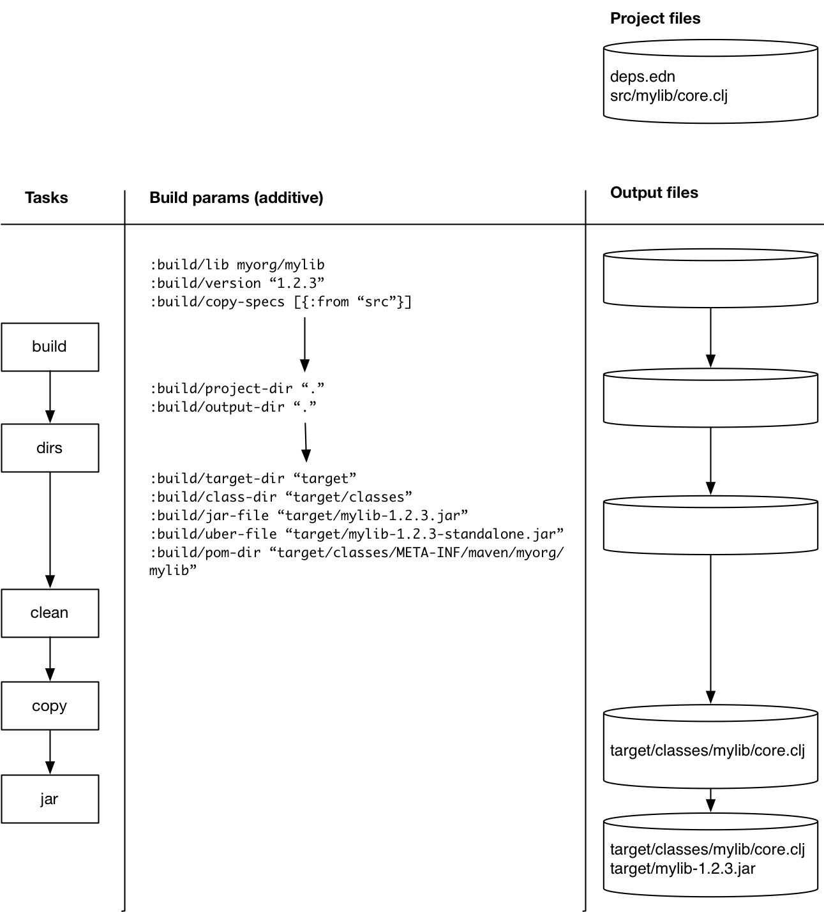

= tools.build Guide
Alex Miller
2020-06-30
:type: guide
:toc: macro

ifdef::env-github,env-browser[:outfilesuffix: .adoc]

toc::[]

== Rationale

The tools.deps library and Clojure CLI tools provide support for building classpaths with dependencies, including source-based dependencies (local- and git-based). However, some libraries require build steps for compilation, resource file transformation, or artifact building.

Builds are themselves programs and tools.build is a library for writing builds in terms of tasks driven by data in the deps.edn file. Many common built-in tasks are provided but the system is also open for extension and combination with other tools as needed. For the common case, support is available for invoking builds from the command line with the Clojure CLI tools.

== Getting started

tools.build is a library for writing Clojure build programs. It depends on tools.deps and the Clojure tools. These related pages may be of use for background:

* https://clojure.org/guides/getting_started[Getting Started guide] - for installing the Clojure tools
* https://clojure.org/guides/deps_and_cli[Deps and CLI guide] - using the Clojure tools
* https://clojure.org/reference/deps_and_cli[Deps and CLI reference] - more detailed reference info about the Clojure tools
* <<xref#reference,tools.build reference>>

== Using tools.build as a Clojure tool

A build is defined in terms of tasks and params. The tasks are executed sequentially and params can be specified either for all tasks or specific tasks. Task-specific parameters override the main parameters.

The easiest way to define params and tasks is as data in a deps.edn alias. For example a deps.edn file may look like this:

[source,clojure]
----
{:paths ["src"]
 :deps {}

 :aliases
 {:build
  {:tasks [[dirs] [clean] [copy] [jar]]
   :params
   {:build/lib myorg/mylib
    :build/version "1.2.3"
    :build/copy-specs [{:from "src"}]}}}}
----

The `:build` alias is not special, it can be named anything and there may be multiple build build definitions in the aliases.

Each task is a vector consisting of a task name and an optional task-specific parameter map. Built-in tasks are unqualified, custom tasks should be qualified and refer to the function implementing the task.

The parameter map flows through the tasks and tasks may emit new parameters that will be added to the flowing parameters. Generally, tasks should emit parameters that are additive to the build parameter map, not override previous values. Generally any parameter may have a value that is itself the name of another parameter holding the value OR an alias in the deps.edn.

In this example, there are four tasks, all likely to exist in a build that compiles a library jar. The tasks work as follows:

* `dirs` - uses `:build/output-dir`, `:build/lib`, `:build/version` etc to initialize many output directories and files which are emitted to the build parameters
* `clean` - removes the target directory (this is one of the directories defined by `dirs`)
* `copy` - copies clojure source files from the project directory to the jar assembly directory
* `jar` - creates a jar from the jar assembly directory and writes it to the target directory

== Writing a build program

