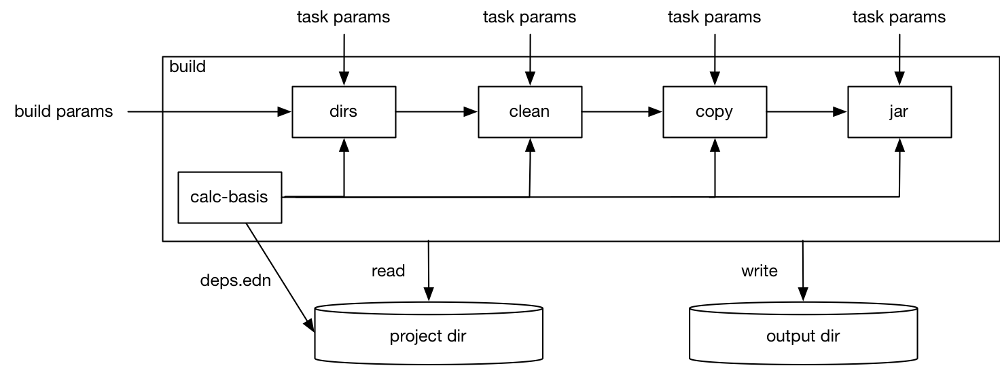

= tools.build Reference
Alex Miller
2020-06-29
:type: reference
:toc: macro

ifdef::env-github,env-browser[:outfilesuffix: .adoc]

toc::[]

== Rationale

The tools.deps library and Clojure CLI tools provide support for building classpaths with dependencies, including source-based dependencies (local- and git-based). However, some libraries require build steps for compilation, resource file transformation, or artifact building.

Builds are themselves programs and tools.build is a library providing tasks that build writers can use. Many common built-in tasks are provided but the system is also open for extension and combination with other tools as needed. Builds, as programs, can be developed interactively at the REPL, and run at the REPL or via the Clojure CLI.

== Overview and Terms

* Basis - given a chain of deps.edn files and modifiers to resolve-deps, make-classpath, etc, the tools.deps library will produce a "runtime basis" consisting of the library and classpath execution environment and alias data
* Build - a build is a program that runs a ordered series of build tasks to create one or more artifacts
* Task - a build step, invoked with a map of parameters, including the basis
* Project directory - the directory containing deps.edn and all other project source files

== Built-in tasks

The primary entry point for tools.build is the clojure.tools.build.api namespace.

The following built-in tasks are provided (these may all be specified unqualified):

[options="header", role="table"]
|===
| Task | Description
| `clean` | Clean `:build/target-dir` 
| `compile-clj` | Compile Clojure namespaces to `:build/class-dir`
| `sync-pom` | Emit pom from project deps and optionally a source pom to `:build/pom-dir`
| `javac` | Compile Java source to `:build/class-dir`
| `copy` | Copy files from source to output (w/string replacement
| `jar` | Create a jar of `:build/class-dir` to `:build/jar-file`
| `uber` | Create an uberjar (the output jar plus dependent jars) to `:build/uber-file`
| `zip` | Zip output files
| `install` | Install the created jar to local Maven cache
|===

=== clean task

[options="header", role="table"]
|===
| Parameter | Required? | Description
| `:dir` | yes | Target directory
|===

Removes `:dir` recursively.

=== compile-clj task

[options="header", role="table"]
|===
| Key in basis | Description
| `:classpath` | Classpath data from basis
|===

[options="header", role="table"]
|===
| Parameter | Required? | Description
| `:class-dir` | yes | Class output dir
| `:clj-paths` | yes | Coll of Clojure source dirs
| `:compiler-opts` | | Map of https://clojure.org/reference/compilation#_compiler_options[compiler options]
| `:ns-compile` | | Coll of namespace symbols to compile (if not supplied, compile all)
| `:filter-nses` | | Coll of namespace symbol roots to keep after compiling
|===

The `compile-clj` task compiles either an explicit list of namespaces in `:ns-compile` (if provided) or all namespaces detected in `:clj-paths` (one of these is required). Namespaces are compiled with `:compiler-opts` if provided and filtered with `:filter-nses` (coll of namespace prefix symbols) into `:class-dir`.

Compilation occurs in a forked process using the `:classpath` from the computed project basis. Compilation errors will be printed to stderr and will cause build execution to abort.

Example compiling all Clojure namespaces in Clojure source paths (when making an uberjar for example):

[source,clojure]
----
[compile-clj {:class-dir "target/classes"
              :clj-paths ["src"]}]
----

Example compiling specific Clojure namespaces with direct linking and keeping only classes from this library:

[source,clojure]
----
[compile-clj {:basis basis
              :class-dir "target/classes"
              :ns-compile [a.b.c a.b.d]
              :compiler-options {:direct-linking true}
              :filter-nses [a.b]}]
----

=== javac task

[options="header", role="table"]
|===
| Key in basis | Description
| `:libs` | Lib map data from basis
|===

[options="header", role="table"]
|===
| Parameter | Required? | Description
| `:build/project-dir` | yes | Project dir
| `:build/output-dir` | yes | Output dir
| `:build/class-dir` | yes | Class output dir, relative to `:build/output-dir`
| `:build/java-paths` | yes | Coll of Java source roots, relative to `:build/project-dir`
| `:build/javac-opts` | | Coll of Java options to be used with javac
|===

Compile all Java source files under `:build/java-paths` with `:build/javac-opts` into `:build/class-dir`. Compilation occurs in-process. Compilation errors will be printed to stderr and will cause build execution to abort.

Example:

[source,clojure]
----
[javac {:build/project-dir "..."
        :build/target-dir "target"
        :build/class-dir "classes"
        :build/java-paths :java-paths
        :build/javac-opts ["-source" "8" "-target" "8"]}]
----

=== sync-pom task

[options="header", role="table"]
|===
| Parameter | Required? | Description
| `:build/project-dir` | yes | Project dir
| `:build/output-dir` | yes | Output dir 
| `:build/pom-dir` | yes | Pom output directory, resolved relative to `:build/output-dir`
| `:build/src-pom` | default="pom.xml"| Source pom file, relative to `build/project-dir`
| `:build/lib` | yes
| `:build/version` | yes
|===

Write pom.xml and pom.properties to `<output-dir>/<pom-dir>`, matching Maven conventions. The `:build/src-pom` is used as a base pom.xml file if it exists, then updated with dependencies, repositories, src dir, maven coordinates, etc based on the params and/or the deps.edn in `:build/project-dir`.

=== copy task

[options="header", role="table"]
|===
| Parameter | Required? | Description
| `:build/project-dir` | yes | Project dir
| `:build/output-dir` | yes | Output dir
| `:build/copy-to` | | Directory, relative to `:build/target-dir` to copy to, defaults to `:build/class-dir`
| `:build/copy-specs` | yes | Coll of copy specs specifying what to copy
|===

Each copy spec has the following keys:

[options="header", role="table"]
|===
| Copy spec key | Description
| `:from` | Directory or coll of dirs resolved relative to `:build/project-dir`
| `:include` | File glob or coll of file globs to include
| `:replace` | Map of string replacements to make in this copy, from source text to replacement text (which may also be params)
|===

The copy task copies all files specified by the copy specs to the `copy-to` directory (by default `:build/class-dir`), defaults intended for copying resource files (but other uses possible, typically with per-task overrides). The paths relative to `:from` are retained in the copy.

Copying Clojure sources for jar inclusion:

[source,clojure]
----
[copy {:build/project-dir "..."
       :build/target-dir "target"
       :build/class-dir "classes"
       :build/copy-specs [{:from :clj-paths}]}]
----

Copying resources with replacement:

[source,clojure]
----
[copy {:build/project-dir "..."
       :build/target-dir "target"
       :build/class-dir "classes"
       :build/copy-specs [{:from "resources" :replace {"$version" :build/version}}]}]
----

Copying licenses from legal dir:

[source,clojure]
----
[copy {:build/project-dir "..."
       :build/target-dir "target"
       :build/class-dir "classes"
       :build/copy-specs [{:from "legal" :include "**license*"}]}]
----

=== jar task

[options="header", role="table"]
|===
| Parameter | Required? | Description
| `:build/output-dir` | yes | Output dir
| `:build/class-dir` | yes | Class assembly dir, resolved relative to `:build/output-dir`
| `:build/jar-file` | yes | Jar file name, resolved relative to `:build/output-dir`
| `:build/main-class` | | Symbol for the Clojure namespace with a -main or Java main class
|===

Create jar file named `jar-file` in `output-dir` containing contents of `class-dir`. Manifest will have `main-class` set.

=== uber task

[options="header", role="table"]
|===
| Key in basis | Description
| `:libs` | Lib map data from basis
|===

[options="header", role="table"]
|===
| Parameter | Required? | Description
| `:build/output-dir` | yes | Output dir
| `:build/target-dir` | yes | Target dir
| `:build/class-dir` | yes | Class output dir, resolved relative to `:build/target-dir`
| `:build/uber-file` | yes | Name of output uber jar file, resolved relative to `:build/output-dir`
| `:build/main-class` | | Symbol for the Clojure namespace with a -main or Java main class
|===

Create an uber jar that contains the contents of the `:build/class-dir` and all library dependencies from the basis lib map. Set main-class in the manifest. Assembly occurs in `target-dir/uber` directory.

These resources are filtered (not yet configurable):

* `#"META-INF/.*\.(?:SF|RSA|DSA)"`

In the case of multiple jars with the same resource (not yet configurable):

* data_readers.clj(c) - merge
* anything else - print conflict to stdout

=== zip task

[options="header", role="table"]
|===
| Parameter | Required? | Description
| `:build/output-dir` | yes | Output dir
| `:build/zip-dir` | yes | Directory relative to `:build/output-dir` to assemble zip
| `:build/zip-name` | yes | Name of output zip file, relative to `:build/output-dir`
|===

Creates zip file of zip-dir's contents in zip-name.

=== install task

* Prereq tasks: expects jar file from `jar` task and pom file from `sync-pom` task

[options="header", role="table"]
|===
| Key in basis | Description
| `:mvn/local-repo` | Local repository location (default to `~/.m2/repository`)
|===

[options="header", role="table"]
|===
| Parameter | Required? | Description
| `:build/output-dir` | yes | Output dir
| `:build/lib` | yes | Qualified symbol defining this projects lib name (in Maven terms `groupId/artifactId`)
| `:build/classifier` | | String specifying the library classifier
| `:build/version` | yes | String representing this project's version number
|===

Installs the jar (created by the `jar` task) into the Maven local repository.

== Usage as a deps tool

Add an alias to your deps.edn for builds:

[source,clojure]
----
{...
 :aliases
 {:build
  {:replace-deps {io.github.clojure/tools.build {:git/url "git@github.com:cognitect-labs/tools.build.git"
                                                 :git/tag "TAG", :git/sha "PREFIX-SHA"}}
   :replace-paths ["."]
   :ns-default build}}}
----

Run the function `jar` in build.clj: 

[source]
----
clj -X:build jar
----

== Creating new tasks

Tasks are functions that take a map. 

Tasks can use any external dependencies that are needed (these will be added to your deps.edn :build alias alongside tools.build).
